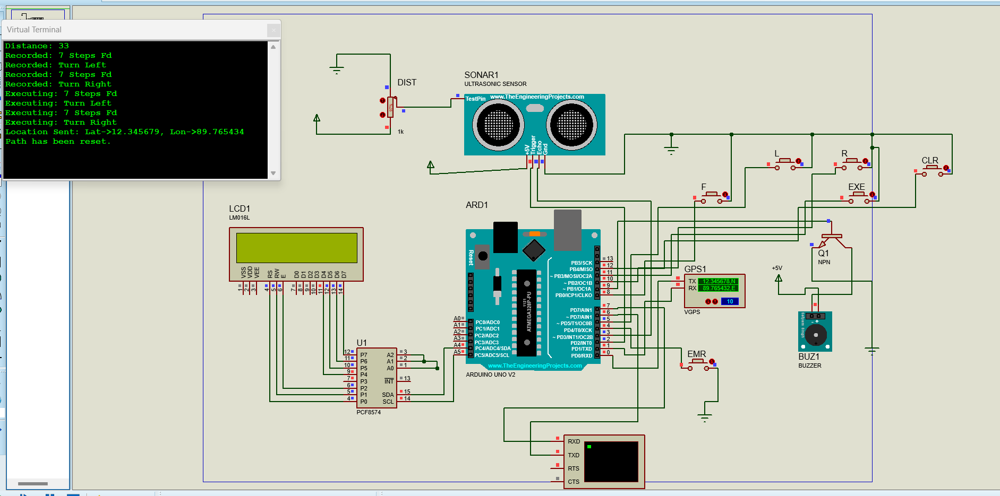

# 🦯 Smart Blind Stick with Indoor Path Memorization

<div align="center">
  

  > An innovative solution for indoor navigation and safety of visually impaired people
</div>

## 🌟 Problem Statement
While GPS works well for outdoor navigation, indoor positioning remains a challenge for the visually impaired. This project introduces a smart blind stick that memorizes indoor paths and provides enhanced safety features.

## 🔍 Key Features

### 🗺️ Path Memorization
- Indoor path recording and playback
- Reference point marking
- Turn-by-turn guidance

### ⚡ Safety Features
- Ultrasonic obstacle detection
- Emergency alert system
- Real-time location sharing with relatives
- Audio feedback through beeping signals

### 📍 Location Services
- Indoor position tracking
- Emergency GPS coordination sharing
- Last known location storage

## 🛠️ Technical Implementation

### Hardware Components (Simulated)
- Ultrasonic sensors
- GPS module
- Emergency button
- Microcontroller
- Buzzer for alerts

### Software Requirements
- Proteus Professional (Latest Version)
- Required Libraries:
  - GPS Module Library
  - Ultrasonic Sensor Library
  - Path Memorization Module

## ⚙️ Setup Instructions

1. **Install Proteus:**
   - Download and install Proteus Professional
   - Ensure proper licensing

2. **Import Libraries:**
   ```bash
   # Add these libraries to Proteus
   - GPS_Module.lib
   - Ultrasonic_Sensor.lib
Load Project:

Open Proteus
Load Project_Completed2.pdsprj
Verify all components are properly linked
Run Simulation:

Start the simulation
Test different scenarios:
Obstacle detection
Path recording
Emergency alerts


Code
- Press START button
- Walk through desired path
- System records turning points
- Press STOP to save path
Navigation Mode:

Code

- Select saved path
- Follow audio guidance
- Ultrasonic sensors provide obstacle warnings
- Emergency button for instant help
  
Emergency Protocol:

Code
- Press emergency button
- GPS coordinates captured
- Location sent to preset contacts
- Continuous alert until acknowledged


💡 Unique Aspects

Indoor Positioning: Works without GPS dependency

Path Memory: Learns and remembers frequently used routes

Hybrid Navigation: Combines ultrasonic and memorized path data

Emergency Response: Instant location sharing with relatives


🤝 Future Improvements

Add temperature sensors

Implement machine learning for path optimization

Develop mobile app integration

Add voice command features


👥 Contributors

Naveen Beniwal

📞 Support

For setup assistance or queries:

📧 Email: naveenbeniwal00001@gmail.com
🔗 GitHub: Project Repository
